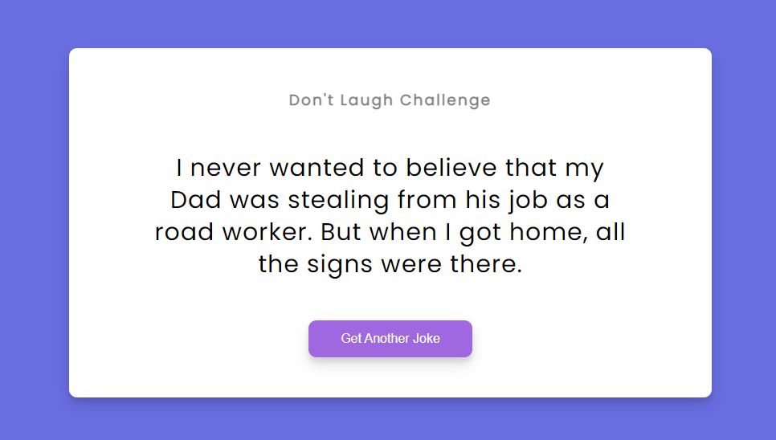

# This is a 50 projects course using HTML, CSS and JavaScript.
### This course was created by Brad Traversy on [Udemy](https://www.udemy.com/course/50-projects-50-days/)
The projects include:

 - 01	Expanding Cards	&check;  

 - 02	Progress Steps	&check;  

 - 03	Rotating Navigation Animation	&check;
 
 - 04	Hidden Search Widget	&check;
  
 - 05	Blurry Loading	 &check;
  
 - 06	Scroll Animation	&check;
 - 07	Split Landing Page	&check;
 - 08	Form Wave	&check;
 - 09	Sound Board	&check;
 - 10	Dad Jokes	&check;
 
 - 12	Faq Collapse	&check;
 - 11	Event Keycodes	&check;
 - 13	Random Choice Picker	&check;
 - 14	Animated Navigation	 &check;
 
 - 15	Incrementing Counter	&check;
 - 16	Drink Water	  &check;
 - 17	Movie App	&check;
 - 18	Background Slider	&check;
 - 19	Theme Clock	&check;
 - 20	Button Ripple Effect	
 - 21	Drag N Drop	
 - 22	Drawing App	
 - 23	Kinetic Loader	
 - 24	Content Placeholder	
 - 25	Sticky Navbar	
 - 26	Double Vertical Slider	
 - 27	Toast Notification	
 - 28	Github Profiles	
 - 29	Double Click Heart	
 - 30	Auto Text Effect	
 - 31	Password Generator	
 - 32	Good Cheap Fast	
 - 33	Notes App	
 - 34	Animated Countdown	
 - 35	Image Carousel	
 - 36	Hoverboard	
 - 37	Pokedex	
 - 38	Mobile Tab Navigation	
 - 39	Password Strength Background	
 - 40	3d Background Boxes	
 - 41	Verify Account Ui	
 - 42	Live User Filter	
 - 43	Feedback Ui Design	
 - 44	Custom Range Slider	
 - 45	Netflix Mobile Navigation	
 - 46	Quiz App	
 - 47	Testimonial Box Switcher	
 - 48	Random Image Feed	
 - 49	Todo List	
 - 50	Insect Catch Game	
